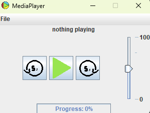

# JavaMediaPlayer

A simple media player written in Java to play `.mp3`, `.aac`, and `.wav` files.

# How to Use

To use MediaPlayer, please download from [the Releases page](https://github.com/goldcoin10/JavaMediaPlayer/releases/tag/release) and simply just double click it on Windows.

# Features

* Ability to play `.mp3`, `.aac`, and `.wav` files.
* Go 5 seconds ahead and back.
* Progress bar, to see how far you are in
* Volume slider to change volume

# How it Works

This project uses JavaFX to play the audio and Swing to render the buttons. The reason why I did not use JavaFX for the UI is because Swing is just easier.

# Credit

Some snippits of code were written by Claude to fix bugs, but everything else was written and drawn by me.
